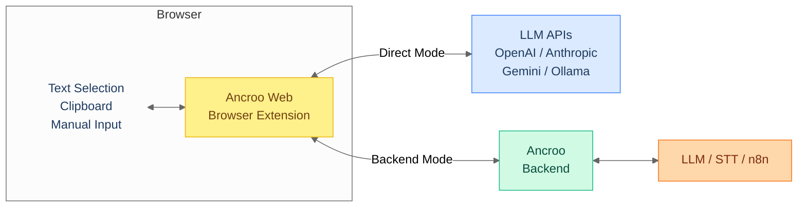

#  Ancroo Web

[](LICENSE)
[](https://www.typescriptlang.org/)
[](https://preactjs.com/)
[](https://vite.dev/)
[](https://tailwindcss.com/)
[](https://pnpm.io/)
[](https://developer.chrome.com/docs/extensions/)
[]()

AI Workflow Runner for your Browser. Select text, trigger a workflow, get results — directly in the page.

Manifest V3 browser extension built with Preact and TypeScript. Works standalone with any LLM API or with a self-hosted [Ancroo Backend](https://github.com/ancroo/ancroo-backend) for the full feature set.

> **Phase 0 (Beta)** — The extension works end-to-end. In Backend Mode, the server runs without encryption or authentication by default — intended for local/trusted networks only. See the [Ancroo Roadmap](https://github.com/ancroo/ancroo/blob/main/ROADMAP.md) for the security path forward.


## Two Modes

### Direct Mode — No server needed

Connect directly to OpenAI, Anthropic, Google Gemini, Ollama, or any OpenAI-compatible API. Just install the extension, add your API key, and go. Starter workflows (Summarize, Translate, Rewrite, Explain, Fix Grammar, Ask AI) are created automatically.

### Backend Mode — Full feature set

Connect to a self-hosted [Ancroo Stack](https://github.com/ancroo/ancroo-stack) for the complete experience: speech-to-text, n8n automation, tool plugins, file uploads, multi-user support, and server-managed workflows.



## Features

### Both Modes

- **Side panel UI** — browse and trigger workflows from a side panel (`Alt+Shift+Y` or click the extension icon)
- **Text selection** — select text on any page, right-click "Run with Ancroo", and get AI-processed results
- **Hotkeys** — keyboard shortcuts trigger workflows instantly from any page
- **Clipboard & page context** — workflows can access clipboard content and the current page URL/title
- **Output actions** — results can replace selected text, copy to clipboard, insert before/after, or show in panel
- **Execution history** — last 50 results are stored locally for quick access and re-use

### Direct Mode

- **Multiple LLM providers** — OpenAI, Anthropic, Google Gemini, Ollama (local), OpenRouter, or any OpenAI-compatible endpoint
- **Starter workflows** — six ready-to-use workflows (Summarize, Translate, Rewrite, Explain, Fix Grammar, Ask AI) are created automatically using the first available model from your provider
- **Local workflow editor** — create and manage workflows with prompt templates, model selection, and input/output configuration
- **Model browser** — auto-detects available models from your provider
- **Minimal permissions** — known LLM APIs and localhost work out of the box; custom URLs (e.g. Ollama on a LAN IP or a self-hosted backend) prompt for permission only when needed
- **No server required** — everything runs in the browser extension

### Backend Mode

- **Push-to-talk audio** — record speech directly in the browser and send it to a Whisper STT workflow
- **Form field capture** — workflows can read form fields from the current page (e.g. for data extraction)
- **File upload** — drag-and-drop or pick files to send to a workflow (with type and size validation)
- **Tool integration** — connect workflows to n8n automations and Ancroo Runner plugins
- **Multi-user** — OAuth2 PKCE authentication with per-user workflow permissions
- **Server-managed workflows** — centralized workflow management via the admin UI

## Install

### Option A: Download pre-built artifact (recommended)

Every push to `main` automatically builds the extension via GitHub Actions. Download the latest artifact without building locally:

1. Open [Actions](https://github.com/ancroo/ancroo-web/actions/workflows/build.yml)
2. Click the latest successful run
3. Download the **ancroo-web-extension** artifact
4. Unzip it — you get a `dist/` folder

Then load in Chrome:

1. Open `chrome://extensions`
2. Enable **Developer mode**
3. Click **Load unpacked**
4. Select the `dist/` folder

### Option B: Build locally

```bash
pnpm install
pnpm build
```

Or use the helper script (auto-installs pnpm via corepack if missing):

```bash
./build.sh
```

Then load the `dist/` folder in Chrome as described above.

## Development

```bash
pnpm dev
```

## Project Structure

```
src/
├── background/    # Service worker
├── content/       # Content script (text selection, insertion)
├── shared/        # API client, types, settings, LLM adapters, messages
│   └── llm/       # Direct LLM provider adapters (OpenAI, Anthropic, Gemini, Ollama)
└── sidepanel/     # Side panel UI (Preact)
```

## Backend (optional)

For the full feature set (STT, tools, n8n, multi-user), install the [Ancroo Stack](https://github.com/ancroo/ancroo-stack) with the Ancroo Backend:

```bash
bash /path/to/ancroo-backend/install-stack.sh /path/to/ancroo-stack
```

The extension works without a backend in Direct Mode — just add your LLM provider API key in the setup screen.

## Contributing

Contributions are welcome! Feel free to open an [issue](https://github.com/ancroo/ancroo-web/issues) or submit a pull request.

## Privacy

See [Privacy Policy](PRIVACY_POLICY.md) — Ancroo collects no data. All settings, API keys, and history stay in your browser. Data is only sent to LLM providers or backends you configure.

## Security

**API Keys (Direct Mode):** API keys are stored in `chrome.storage.local`, which is sandboxed per extension and not accessible by websites or other extensions. Keys are only sent to the configured LLM provider. Note that the storage is not encrypted on disk — anyone with access to your browser profile can read them. This is standard practice for browser extensions.

To report a security vulnerability, please use [GitHub's private vulnerability reporting](https://github.com/ancroo/ancroo-web/security/advisories/new) instead of opening a public issue.

## Acknowledgments

This project is built with the following open-source software:

| Project                                       | Purpose                            | License    |
| --------------------------------------------- | ---------------------------------- | ---------- |
| [Preact](https://preactjs.com/)               | UI framework                       | MIT        |
| [Vite](https://vite.dev/)                     | Build tool                         | MIT        |
| [CRXJS](https://crxjs.dev/vite-plugin/)       | Vite plugin for browser extensions | MIT        |
| [Tailwind CSS](https://tailwindcss.com/)      | CSS framework                      | MIT        |
| [TypeScript](https://www.typescriptlang.org/) | Language                           | Apache-2.0 |

## License

MIT — see [LICENSE](LICENSE). The Ancroo name is not covered by this license and remains the property of the author.

## Author

**Stefan Schmidbauer** — [GitHub](https://github.com/Stefan-Schmidbauer)

---

Built with the help of AI ([Claude](https://claude.ai) by Anthropic).
