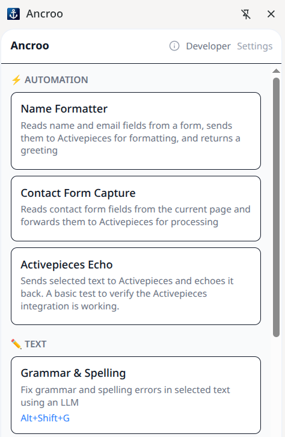
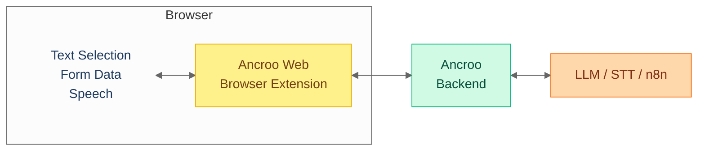

#  Ancroo Web

[](LICENSE)
[](https://www.typescriptlang.org/)
[](https://preactjs.com/)
[]()

AI Workflow Runner for your Browser. Select text, trigger a workflow, get results — directly in the page.

Manifest V3 browser extension built with Preact and TypeScript.

> **Phase 0 (Beta)** — The extension works end-to-end, but the backend it connects to runs without encryption or authentication by default. Intended for local/trusted networks only. See the [Ancroo Roadmap](https://github.com/ancroo/ancroo/blob/main/ROADMAP.md) for the security path forward.



## How It Works



## Features

- **Side panel UI** — browse and trigger workflows from a side panel (`Alt+Shift+Y` or click the extension icon)
- **Text selection** — select text on any page, right-click "Run with Ancroo", and get AI-processed results
- **Hotkeys** — server-defined keyboard shortcuts trigger workflows instantly from any page
- **Push-to-talk audio** — record speech directly in the browser and send it to a Whisper STT workflow
- **Form field capture** — workflows can read form fields from the current page (e.g. for data extraction)
- **Clipboard & page context** — workflows can access clipboard content and the current page URL/title
- **File upload** — drag-and-drop or pick files to send to a workflow (with type and size validation)
- **Output actions** — results can replace selected text, copy to clipboard, or show as a notification
- **Execution history** — last 50 results are stored locally for quick access and re-use
- **Authentication** — OAuth2 PKCE login via the Ancroo Server (optional, when auth is enabled)

## Install

### Option A: Download pre-built artifact (recommended)

Every push to `main` automatically builds the extension via GitHub Actions. Download the latest artifact without building locally:

1. Open [Actions](https://github.com/ancroo/ancroo-web/actions/workflows/build.yml)
2. Click the latest successful run
3. Download the **ancroo-web-extension** artifact
4. Unzip it — you get a `dist/` folder

Then load in Chrome:

1. Open `chrome://extensions`
2. Enable **Developer mode**
3. Click **Load unpacked**
4. Select the `dist/` folder

### Option B: Build locally

```bash
pnpm install
pnpm build
```

Or use the helper script (auto-installs pnpm via corepack if missing):

```bash
./build.sh
```

Then load the `dist/` folder in Chrome as described above.

## Development

```bash
pnpm dev
```

## Project Structure

```
src/
├── background/    # Service worker
├── content/       # Content script (text selection, insertion)
├── shared/        # API client, types, settings, messages
└── sidepanel/     # Side panel UI (Preact)
```

## Backend

This extension requires [Ancroo Stack](https://github.com/ancroo/ancroo-stack) with the `ancroo` module enabled:

```bash
./module.sh enable ancroo
```

## Contributing

Contributions are welcome! Feel free to open an [issue](https://github.com/ancroo/ancroo-web/issues) or submit a pull request.

## Security

To report a security vulnerability, please use [GitHub's private vulnerability reporting](https://github.com/ancroo/ancroo-web/security/advisories/new) instead of opening a public issue.

## Acknowledgments

This project is built with the following open-source software:

| Project | Purpose | License |
|---------|---------|---------|
| [Preact](https://preactjs.com/) | UI framework | MIT |
| [Vite](https://vite.dev/) | Build tool | MIT |
| [CRXJS](https://crxjs.dev/vite-plugin/) | Vite plugin for browser extensions | MIT |
| [Tailwind CSS](https://tailwindcss.com/) | CSS framework | MIT |
| [TypeScript](https://www.typescriptlang.org/) | Language | Apache-2.0 |

## License

MIT — see [LICENSE](LICENSE). The Ancroo name is not covered by this license and remains the property of the author.

## Author

**Stefan Schmidbauer** — [GitHub](https://github.com/Stefan-Schmidbauer)

---

Built with the help of AI ([Claude](https://claude.ai) by Anthropic).
